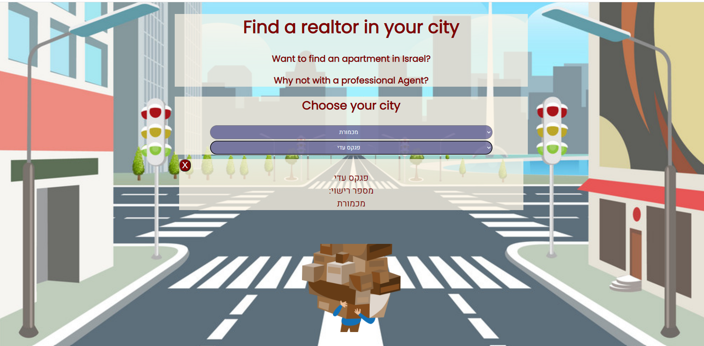

# Realestate agents with mongoDB -

---

### Front to End app with MongoDB

- Back Built with: node js, express, nodemon, dotenv, csvtojson, mongoose
- Front Built with : webpack, css, js, html, es-lint

### Getting started

- npm install
- connect your mongoDB and run `node ./back-end/jobs" to inset data`
- `npm ren dev`
- `npm run build`

---

---

### Task instructions

- [x] Start a new Project, initiating GIT, NPM & Mongo DB.
- [x] Download a csv file of real estate agents from here
- [x] Design a Schema for Agent model
- [x] Write a job script that populates the database using the csv file (see example batch-insert.js)
- [x] Make 3 API endpoints (routes):
  - [x] GET /cities - will respond with a list of all cities
  - [x] GET /agents/?city=<city> - will respond with a list of all agents in that city
  - [x] PUT /agent/:id/edit - will update agent's city
- [x] BONUS implement a frontend application to consume this api.

---
